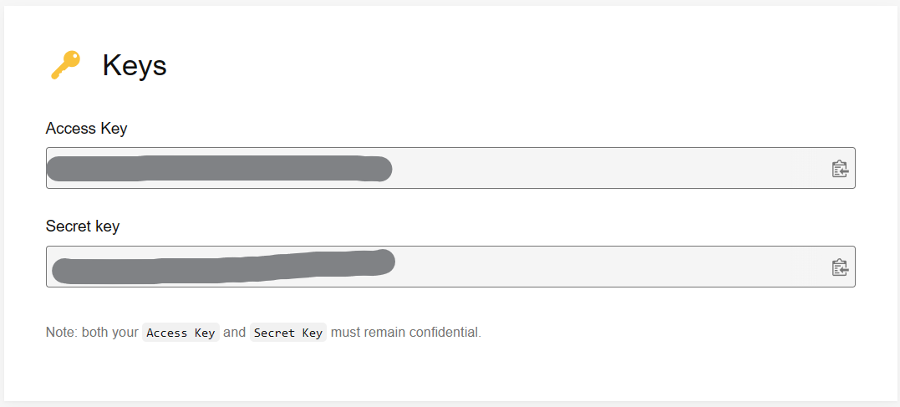

# Banner Generator for Sciwork

## Setup Environment
### Install Packages and Setup Venv
```bash
python3 -m venv venv
source ./venv/bin/activate
pip3 install -r requirements.txt
```

### Register an Unsplash API APP

1. Go to [Unsplash Developer/API](https://unsplash.com/developers) and signup account.
2. Register an application, and navigate to **Keys** section, check the figure below if you do not find it.
3. Copy **ACCESS KEY** to `.env`.



## Generate Banners
1. Edit `.env` and change the value of *EVENT_TITLE*
2. (Optional) Edit `config.py` if needed
    ```python
    class PhotoQuerySetting:
        # Change Keyword for Searching Photos
        query = "code"
        # How many Banner(s) to Generate
        count = 5
    ```
3. You're good to go!
    ```bash
    python3 main.py
    ```